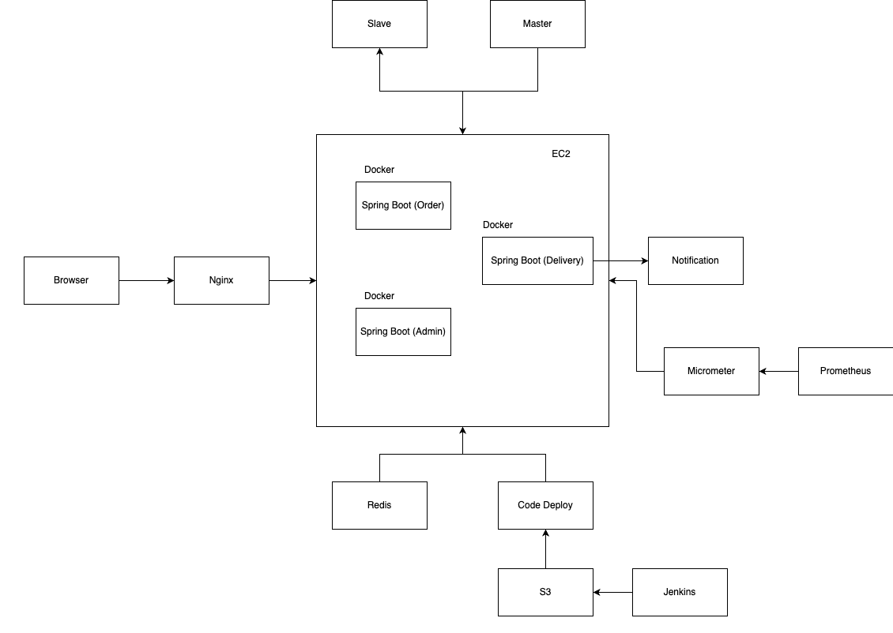
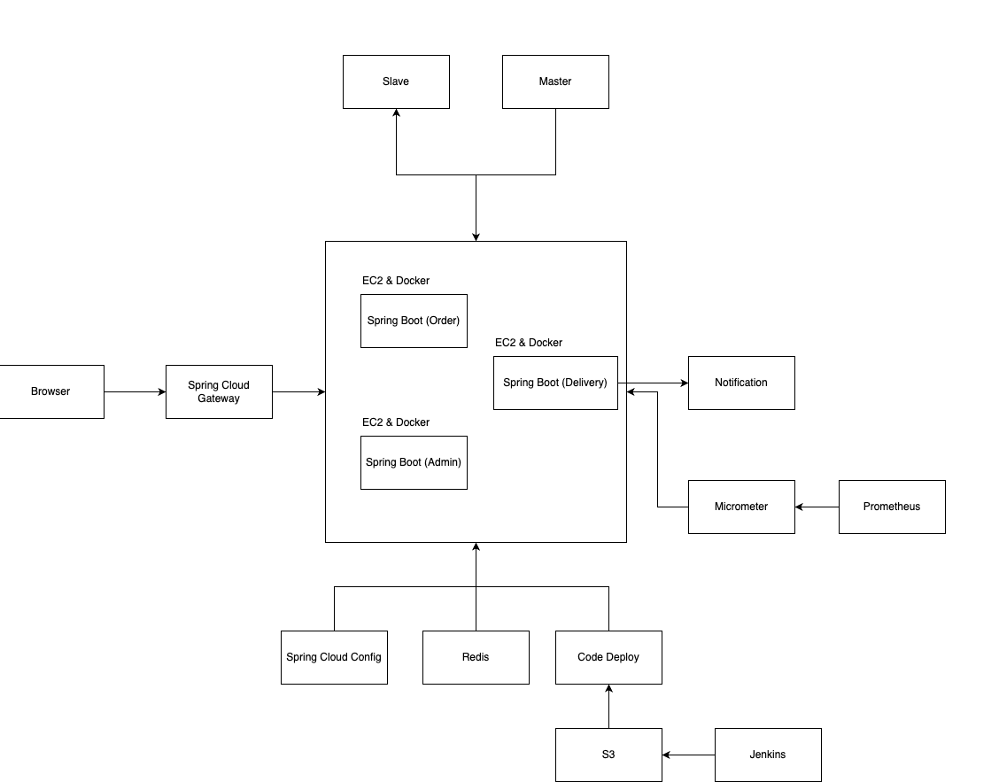
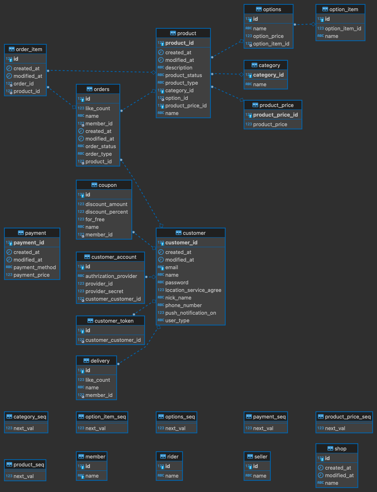

# Starbucks Coffee Order App 

- 간단설명 : 스타벅스에서 원격으로 커피를 주문하듯, 커피를 주문할 수 있는 앱입니다. 

# 요구사항 분석

1. 사용자는 지정된 장소를 선택하여 해당 장소에 커피/음료를 구매하고 해당 음료를 픽업하거나 주문한 제품을 자신의 주소에서 배송 받을 수 있다.
2. 판매자는 영업시간, 판매제품 등을 정할 수 있으며 해당 제품들은 
3. 주문이 완료되면, 대기번호 및 주문 정보 등이 주문자에게 알림이 간다.  
4. 판매자는 기간 할인, 쿠폰 할인, 제품 할인 등 다양한 할인 정책을 제품에 적용할 수 있다. 
5. 배송자는 주문이 들어오면, 사용자 주소로 배송을 진행합니다.  
6. 매일 새벽 03:00, 주문자에게 일별 정산 금액이 계산된다. 
7. 매월 1일 새벽 03:00, 월별 정산 금액이 계산된다. 
8. 판매자는 판매된 데이터를 다양한 검색 조건을 통해, 검색할 수 있다. 
9. 사용자는 다양한 결제 수단(카카오페이, 네이버페이, 신용카드, 계좌이체)을 선택하여, 상품을 구매할 수 있다. 

# 이 앱에서 제공되지 않는 것

1. 프론트엔드 기능 : 백엔드 API 구현에만 집중하므로, 프론트엔드 화면은 제공하지 않습니다. 모든 기능은 포스트맨 혹은 Swagger 문서를 통해 확인할 수 있습니다. 
2. 판매자 편의기능 : 복잡도를 줄이기 위해, 판매자가 제품을 만들기 위해 필요한 원재료에 대한 입고 기능은 제공하지 않습니다. 
3. MSA : 복잡도를 줄이기 위해, 개발 시 하나의 서버로 진행하되, 실제 배포 시에는 서버가 여러 대로 늘 수 있고 (학습을 목적으로) 추후 도메인 별로 나눠 MSA 프로젝트(주문, 배송, 정산 등)로 전환될 수 있습니다.  
4. 실서버 : 비용 상의 문제로, 로컬 환경에서 도커로 필요한 컴포넌트들을 패키징하며, 실제 서버에는 배포하진 않습니다. 

# 시스템 구성 및 아키텍처

1. DB (MySQL) 
2. Server (Spring Boot) 
3. Notification Server 
4. Redis 
5. Load Balancer (Nginx)
6. Docker 
7. CI Pipeline (Jenkins) 
8. CD Pipeline (Amazon CodeDeploy) 
9. 모니터링 (Grafana, Micrometer)
10. 로깅 (MongoDB)

- v1: 멀티모듈

- v2: MSA

# ERD 및 클래스 다이어그램

- erd

# API 문서

- 접속 URL : http://localhost:8080/swagger-ui/index.html
  - 로컬 서버 실행 후 접속 가능 

# 브랜치 관리 전략

- git flow 준수
  - master
  - develop
  - feature
    - order, order-auth 등 기능 단위로 브랜치 관리

# 기술스택

- Spring, Spring Boot, Spring MSA, Spring Data JPA, QueryDSL, MySQL, Redis, Nginx, Docker, Jenkins, Grafana, Micrometer
